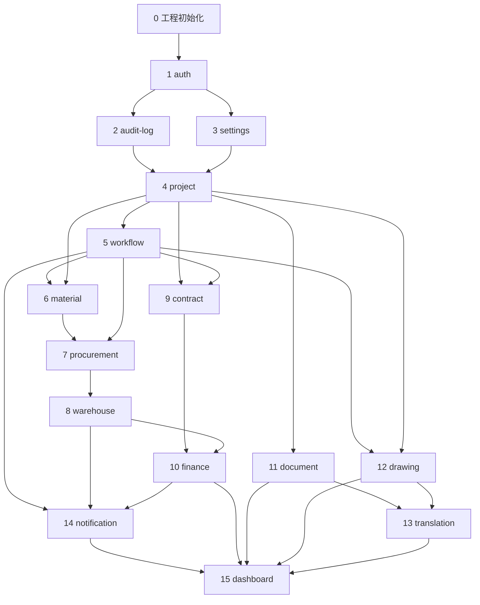

# OverBuild — 实现路线图

> 一个模块一个模块，**完成一个再做下一个**。每个模块必须验收 13 项（见 `docs/06-testing.md`）。

---

## 单模块实现流程

每个模块严格按以下步骤执行，**不得跳步**：

```
① 读文档
      ↓
② 生成数据库（Prisma Schema + Migration + 更新 database.md）
      ↓
③ API（Repository → Service → Controller → DTO → Validation → Swagger → Unit Test）
      ↓
④ 前端（页面 + 组件 + React Query + RBAC 菜单）
      ↓
⑤ 测试（Unit Test + E2E Test + 验收 13 项）
      ↓
⑥ 完成（npm run lint → build → test → test:e2e 全绿）
```

### ① 读文档

- `docs/modules/{module}.md` — 模块功能、字段、API、权限、验收
- `docs/database.md` — 数据表与约束
- `docs/04-api.md` — 统一返回格式
- `docs/05-security.md` — RBAC 权限编码
- `docs/02-ui.md` — UI 规范（前端阶段）

### ⑥ 完成检查

```bash
npm run lint        # 无 error
npm run build       # 构建成功
npm run test        # 单元测试通过
npm run test:e2e    # E2E 通过
```

---

## 阶段 0：工程初始化（一次性）

| 步骤 | 内容 | 状态 |
|------|------|------|
| 0.1 | 文档体系 | ✅ |
| 0.2 | Cursor Rules | ✅ |
| 0.3 | 初始化 monorepo（NestJS + Next.js） | ✅ |
| 0.4 | Docker Compose 本地环境 | ✅ |
| 0.5 | 全局 Layout（Sidebar + TopBar） | ✅ |
| 0.6 | 主题系统（Graphite Gray / Primary Blue / Dark Mode） | ✅ |
| 0.7 | 通用组件（DataTable、Excel 导出、分页、搜索） | ⬜ |
| 0.8 | GitHub Actions CI | ⬜ |

---

## 模块实现顺序（15 个模块）

按依赖关系排序，**从上到下逐个完成**：

```
阶段 A：平台基础
──────────────────────────────────
 1. 登录权限 (auth)
 2. 日志 (audit-log)
 3. 系统设置 (settings)

阶段 B：核心业务
──────────────────────────────────
 4. 项目 (project)

阶段 C：审批引擎
──────────────────────────────────
 5. 审批 (workflow)          ← 采购/财务/合同/图纸依赖

阶段 D：供应链
──────────────────────────────────
 6. 材料 (material)
 7. 采购 (procurement)       ← 依赖 project + material + workflow
 8. 仓库 (warehouse)         ← 依赖 material + procurement

阶段 E：合同与财务
──────────────────────────────────
 9. 合同 (contract)          ← 依赖 project + workflow
10. 财务 (finance)           ← 依赖 project + contract + warehouse

阶段 F：协作与知识
──────────────────────────────────
11. 文档 (document)          ← 依赖 project
12. 图纸 (drawing)           ← 依赖 project + workflow
13. 翻译 (translation)       ← 依赖 document + drawing

阶段 G：聚合与通知（最后）
──────────────────────────────────
14. 通知 (notification)      ← 依赖 workflow + 各业务事件
15. Dashboard (dashboard)    ← 依赖所有模块，必须最后
```

---

## 模块任务清单

### 1. 登录权限 (auth)

- [x] 读文档：`docs/modules/auth.md`
- [x] 数据库：`users`、`roles`、`permissions`、`role_permissions`、`user_roles`
- [x] API：登录/登出/刷新/me、用户管理、角色列表
- [x] 前端：登录页、Dashboard 骨架、Layout
- [x] 测试：auth.service.spec.ts
- [ ] 本地验证：docker + migrate + seed + 验收 13 项
- [ ] 完成

### 2. 日志 (audit-log)

- [x] 读文档：`docs/modules/audit-log.md`
- [x] 数据库：`audit_logs`
- [x] API：`AuditLogService` + 查询接口
- [ ] 前端：日志审计页（管理员）
- [ ] 测试 + 验收 13 项
- [ ] 完成

### 3. 系统设置 (settings)

- [ ] 读文档：`docs/modules/settings.md`
- [ ] 数据库：`system_settings`、`user_preferences`
- [ ] API：系统配置、个人偏好、修改密码
- [ ] 前端：系统设置页、个人设置页
- [ ] 测试 + 验收 13 项
- [ ] 完成

### 4. 项目 (project)

- [ ] 读文档：`docs/modules/project.md`
- [ ] 数据库：`projects`、`project_zones`、`project_members`、`project_milestones`
- [ ] API：项目 CRUD、区域、成员、里程碑、利润/成本分析
- [ ] 前端：项目列表、详情、表单
- [ ] 测试 + 验收 13 项
- [ ] 完成

### 5. 审批 (workflow)

- [ ] 读文档：`docs/modules/workflow.md`
- [ ] 数据库：`approval_instances`、`approval_records`、`approval_templates`
- [ ] API：审批提交/通过/驳回、待办/已办/我发起的
- [ ] 前端：待办列表、审批详情、审批操作
- [ ] 测试 + 验收 13 项
- [ ] 完成

### 6. 材料 (material)

- [ ] 读文档：`docs/modules/material.md`
- [ ] 数据库：`materials`、`material_categories`、`material_price_history`
- [ ] API：材料 CRUD、分类、导入导出、二维码、预警
- [ ] 前端：材料列表、表单、导入、预警
- [ ] 测试 + 验收 13 项
- [ ] 完成

### 7. 采购 (procurement)

- [ ] 读文档：`docs/modules/procurement.md`
- [ ] 数据库：`purchase_requests`、`purchase_orders`、`suppliers`、`quotations`
- [ ] API：采购申请、订单、供应商、询价、审批提交
- [ ] 前端：采购申请、订单、供应商管理
- [ ] 测试 + 验收 13 项
- [ ] 完成

### 8. 仓库 (warehouse)

- [ ] 读文档：`docs/modules/warehouse.md`
- [ ] 数据库：`warehouses`、`stock_inbound`、`stock_outbound`、`stock_balances`、`stock_transactions`
- [ ] API：仓库、入库、出库、盘点、库存查询
- [ ] 前端：入库/出库单、库存报表
- [ ] 测试 + 验收 13 项
- [ ] 完成

### 9. 合同 (contract)

- [ ] 读文档：`docs/modules/contract.md`
- [ ] 数据库：`contracts`、`contract_revisions`
- [ ] API：合同 CRUD、变更、审批、回款关联
- [ ] 前端：合同列表、详情、表单
- [ ] 测试 + 验收 13 项
- [ ] 完成

### 10. 财务 (finance)

- [ ] 读文档：`docs/modules/finance.md`
- [ ] 数据库：`incomes`、`payments`、`collections`、`reimbursements`、`budgets`、`costs`、`invoices`、`cash_accounts`、`bank_accounts`、`exchange_rates`
- [ ] API：收入、付款、回款、报销、预算、成本、发票、报表
- [ ] 前端：财务各子页面、日报/月报
- [ ] 测试 + 验收 13 项
- [ ] 完成

### 11. 文档 (document)

- [ ] 读文档：`docs/modules/document.md`
- [ ] 数据库：`documents`、`document_versions`、`document_categories`
- [ ] API：上传、版本、预览、分类
- [ ] 前端：文档列表、上传、预览
- [ ] 测试 + 验收 13 项
- [ ] 完成

### 12. 图纸 (drawing)

- [ ] 读文档：`docs/modules/drawing.md`
- [ ] 数据库：`drawings`、`drawing_versions`、`drawing_reviews`
- [ ] API：上传、版本、审阅、发布
- [ ] 前端：图纸列表、预览、审阅
- [ ] 测试 + 验收 13 项
- [ ] 完成

### 13. 翻译 (translation)

- [ ] 读文档：`docs/modules/translation.md`
- [ ] 数据库：`translation_tasks`、`translation_versions`、`glossary_terms`
- [ ] API：翻译任务、自动翻译、术语库
- [ ] 前端：翻译任务、术语管理
- [ ] 测试 + 验收 13 项
- [ ] 完成

### 14. 通知 (notification)

- [ ] 读文档：`docs/modules/notification.md`
- [ ] 数据库：`notifications`
- [ ] API：通知列表、未读数、标记已读（BullMQ 推送）
- [ ] 前端：通知铃铛、通知列表
- [ ] 测试 + 验收 13 项
- [ ] 完成

### 15. Dashboard (dashboard)

- [ ] 读文档：`docs/modules/dashboard.md`
- [ ] 数据库：无（聚合查询）
- [ ] API：概览、统计、趋势、排名
- [ ] 前端：首页仪表盘（按角色展示卡片）
- [ ] 测试 + 验收 13 项
- [ ] 完成

---

## 依赖关系图



---

## 当前进度

| 阶段 | 模块 | 状态 |
|------|------|------|
| 0 | 工程初始化 | 基本完成 |
| A | auth → settings | auth/audit-log 进行中 |
| B | project | 未开始 |
| C | workflow | 未开始 |
| D | material → warehouse | 未开始 |
| E | contract → finance | 未开始 |
| F | document → translation | 未开始 |
| G | notification → dashboard | 未开始 |

**下一步**：阶段 0.3 初始化 monorepo → 模块 1 auth
